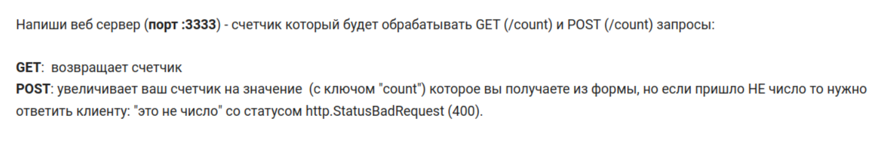

# Задание

Ссылка на задание: https://stepik.org/lesson/1101590/step/7?unit=1112590

 

После решения задания полученный код `main.go` необходимо перенести в данный репозиторий в директорию с данным файлом README.md 

Код должен компилироваться, а сервер запускаться и корректно обрабатывать запросы.

Для локальной отладки можно использовать Postman или Insomnia.
